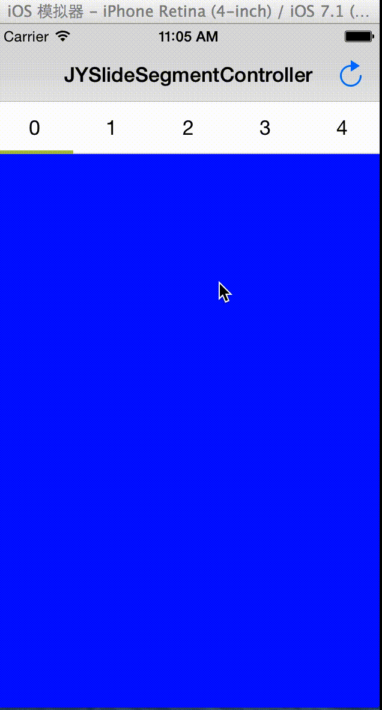

JYSlideSegmentController
========================

JYSlideSegmentController is a view controllers container, just like the UITabBarController, with smooth gesture.

##Demo



##Installation with CocoaPods

#### Podfile

```ruby
platform :ios, '6.0'
pod "JYSlideSegmentController", "~> 1.0.0"
```

## License

JYSlideSegmentController is available under the MIT license. See the LICENSE file for more info.
